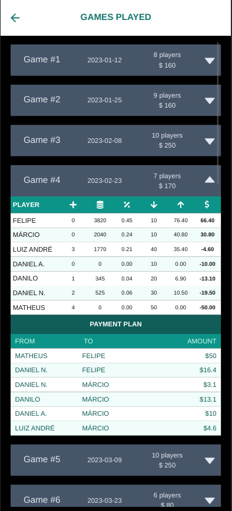

# D/Poker

A Texas Hold'em cash game manager made for and used by friends.

### Features

Add new players and create games

Add rebuys and add a player to an ongoing game

View game history and statistics (a recursive function generates a 'payment plan' after each game)

  

View how players fare against other players (matchups)

  

---

##### Contributors

@azedo - also known as my mentor and React Native dev extraordinaire

Felipe - Java/Kotlin developer who made Spring Boot look cool